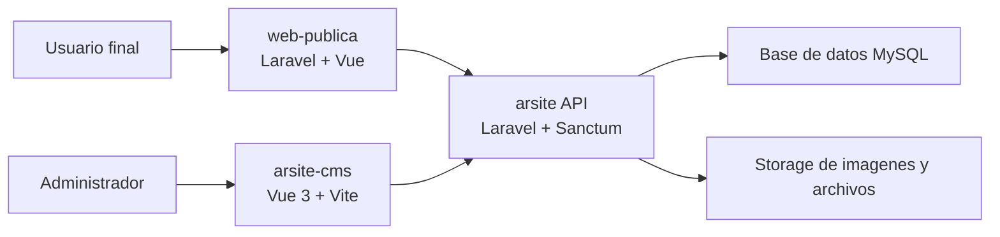

# ProyectoCompleto

Repositorio principal del ecosistema ARSITE. Aqui conviven tres aplicaciones relacionadas:

- `ProyectoBackend/arsite`: API y panel base en Laravel para la gestion del contenido.
- `ProyectoBackend/arsite-cms`: CMS administrativo hecho con Vue 3 + Vite.
- `ProyectoFront/web-publica`: sitio publico corporativo construido con Laravel + Vue.

## Estructura general

```text
ProyectoCompleto/
|-- ProyectoBackend/
|   |-- arsite/
|   `-- arsite-cms/
|-- ProyectoFront/
|   `-- web-publica/
|-- .env.example
`-- README.md
```

## Aplicaciones del proyecto

### 1. Backend API: `ProyectoBackend/arsite`

Aplicacion Laravel que expone la API y centraliza la logica del negocio del CMS.

**Stack**

- PHP 8.2+
- Laravel 12
- Laravel Sanctum
- Laravel Excel
- DomPDF
- Vite + Tailwind CSS 4

**Responsabilidades principales**

- Autenticacion y gestion de usuarios
- CRUD de banners
- CRUD de destacados
- CRUD de productos
- CRUD de servicios
- CRUD de partners
- CRUD de clientes
- CRUD de noticias
- CRUD de hitos
- Registro de contactos desde la web publica
- Exportaciones en PDF y Excel

**Ubicaciones importantes**

- `app/Http/Controllers/Api`: endpoints principales del sistema
- `app/Models`: entidades del dominio
- `routes/api.php`: rutas de la API
- `database/migrations`: estructura de base de datos
- `storage/app/public`: archivos cargados por el sistema

### 2. CMS administrativo: `ProyectoBackend/arsite-cms`

Aplicacion SPA para administrar el contenido que consume la API de `arsite`.

**Stack**

- Vue 3
- Vite 7
- Pinia
- Vue Router
- Tailwind CSS 4
- TipTap
- Axios

**Estructura destacada**

- `src/views`: vistas del panel
- `src/components`: componentes reutilizables
- `src/stores`: estado global con Pinia
- `src/services`: llamadas a la API
- `src/router`: navegacion del CMS
- `src/layouts`: layouts del panel

### 3. Web publica: `ProyectoFront/web-publica`

Sitio web corporativo de ARSITE. Combina Laravel como contenedor y Vue como frontend.

**Stack**

- PHP 8.2+
- Laravel 12
- Vue 3
- Vue Router
- Vite 7
- Tailwind CSS 4
- Axios
- `vue3-recaptcha2`

**Estructura destacada**

- `resources/js/pages`: paginas del sitio
- `resources/js/components`: componentes reutilizables
- `resources/js/router`: rutas del frontend
- `routes/web.php`: entrada SPA para Vue
- `public/` y `Images/`: recursos estaticos

## Relacion entre los proyectos

- `arsite` funciona como backend y API principal.
- `arsite-cms` es el panel administrativo que consume la API para gestionar contenido.
- `web-publica` es el sitio que muestra la informacion institucional y puede enviar formularios de contacto al backend.

## Requisitos

Antes de ejecutar el proyecto conviene tener instalado:

- PHP 8.2 o superior
- Composer
- Node.js 20 o superior
- NPM
- MySQL

## Configuracion rapida

### Backend API: `ProyectoBackend/arsite`

```bash
cd ProyectoBackend/arsite
composer install
npm install
copy .env.example .env
php artisan key:generate
php artisan migrate
npm run dev
php artisan serve
```

### CMS: `ProyectoBackend/arsite-cms`

```bash
cd ProyectoBackend/arsite-cms
npm install
npm run dev
```

### Web publica: `ProyectoFront/web-publica`

```bash
cd ProyectoFront/web-publica
composer install
npm install
copy .env.example .env
php artisan key:generate
php artisan migrate
npm run dev
php artisan serve
```

## Variables de entorno

En la raiz del repositorio existe un `.env.example` basico con configuracion de Laravel y MySQL. Cada aplicacion Laravel puede requerir su propio `.env` ajustado a su base de datos, URL local y servicios externos.

## Puertos sugeridos para desarrollo local

Estos puertos no estan forzados en la configuracion actual, pero son una propuesta practica para trabajar sin conflictos:

| Aplicacion | Rol | Puerto sugerido |
|---|---|---|
| `ProyectoBackend/arsite` | API Laravel | `8000` |
| `ProyectoBackend/arsite-cms` | CMS Vue + Vite | `5173` |
| `ProyectoFront/web-publica` | Web publica Laravel | `8001` |
| `ProyectoFront/web-publica` | Vite de apoyo para assets | `5174` |

### Ejemplo de URLs locales

- API backend: `http://127.0.0.1:8000`
- CMS: `http://127.0.0.1:5173`
- Web publica: `http://127.0.0.1:8001`

### Variable recomendada para el CMS

En `ProyectoBackend/arsite-cms` conviene definir:

```env
VITE_API_BASE_URL=http://127.0.0.1:8000/api
```

Esto coincide con la forma en que `src/services/api.js` construye las llamadas HTTP del panel administrativo.

## Flujo de conexion entre CMS y API

### Flujo observado en el codigo

1. El administrador abre `arsite-cms`.
2. El CMS usa Axios desde `src/services/api.js`.
3. La URL base se toma de `VITE_API_BASE_URL`.
4. El usuario inicia sesion contra el backend.
5. El backend responde con autenticacion y datos del usuario.
6. El CMS guarda el token en `localStorage` o `sessionStorage`.
7. En peticiones posteriores, el CMS agrega `Authorization: Bearer <token>`.
8. Laravel Sanctum protege las rutas privadas.
9. El CMS consume los modulos del sistema: usuarios, banners, productos, servicios, clientes, partners, noticias, contactos e hitos.

### Flujo de la web publica dentro del ecosistema

1. El usuario final abre `web-publica`.
2. Laravel entrega la vista base y Vue monta la SPA.
3. La web publica muestra contenido institucional y formularios.
4. Los datos administrados desde el CMS viven en el backend `arsite`.
5. Los mensajes y registros generados desde la web pueden terminar siendo revisados desde el CMS.

### Relacion por capas

- `arsite-cms` administra contenido y usuarios.
- `arsite` centraliza autenticacion, reglas de negocio, archivos y datos.
- `web-publica` presenta la informacion al usuario final.

## Endpoints principales

Los endpoints mas relevantes encontrados en `ProyectoBackend/arsite/routes/api.php` son:

### Autenticacion

- `POST /api/auth/login`
- `POST /api/auth/register`
- `POST /api/auth/forgot-password`
- `POST /api/login`
- `POST /api/register`
- `POST /api/forgot-password`
- `POST /api/logout`
- `POST /api/logout-all`
- `GET /api/me`
- `GET /api/check`
- `PUT /api/profile`
- `PUT /api/change-password`
- `GET /api/verify-token`
- `GET /api/refresh`
- `GET /api/tokens`
- `DELETE /api/tokens/{tokenId}`

### Contactos

- `POST /api/contactos`
- `GET /api/contactos`
- `GET /api/contactos/statistics`
- `GET /api/contactos/recent`
- `GET /api/contactos/export`
- `PUT /api/contactos/bulk-status`
- `DELETE /api/contactos/bulk-delete`

### Modulos principales del CMS

- `apiResource /api/users`
- `apiResource /api/banners`
- `apiResource /api/destacados`
- `apiResource /api/productos`
- `apiResource /api/servicios`
- `apiResource /api/partners`
- `apiResource /api/clientes`
- `apiResource /api/noticias`
- `apiResource /api/hitos`

### Operaciones auxiliares

- `GET /api/banners/export`
- `PUT /api/banners/update-order`
- `DELETE /api/banners/bulk-delete`
- `GET /api/destacados/export`
- `PUT /api/destacados/update-order`
- `DELETE /api/destacados/bulk-delete`
- `GET /api/productos/export`
- `GET /api/productos/statistics`
- `PUT /api/productos/update-order`
- `DELETE /api/productos/bulk-delete`
- `GET /api/servicios/export`
- `GET /api/servicios/statistics`
- `PUT /api/servicios/update-order`
- `DELETE /api/servicios/bulk-delete`
- `GET /api/partners/export`
- `GET /api/partners/statistics`
- `PUT /api/partners/update-order`
- `PUT /api/partners/bulk-status`
- `DELETE /api/partners/bulk-delete`
- `GET /api/clientes/export`
- `GET /api/clientes/statistics`
- `PUT /api/clientes/update-order`
- `PUT /api/clientes/bulk-update-status`
- `POST /api/clientes/bulk-delete`
- `GET /api/noticias/featured`
- `GET /api/noticias/statistics`
- `PUT /api/noticias/bulk-status`
- `DELETE /api/noticias/bulk-delete`
- `GET /api/hitos/statistics`
- `PUT /api/hitos/update-order`
- `PUT /api/hitos/bulk-status`
- `DELETE /api/hitos/bulk-delete`

### Endpoints publicos de consulta

- `GET /api/clientes/public`
- `GET /api/productos/public`
- `GET /api/servicios/public`
- `GET /api/partners/public`
- `GET /api/noticias/public`
- `GET /api/hitos/public`

## Rutas visibles del CMS

Las vistas principales detectadas en el panel son:

- `/login`
- `/register`
- `/dashboard`
- `/users`
- `/perfil`
- `/banners`
- `/sliders`
- `/products`
- `/clients`
- `/services`
- `/partners`
- `/contact`
- `/news`
- `/milestones`

## Diagrama rapido de arquitectura



## Conexion recomendada en local

Una forma ordenada de levantar todo el ecosistema es:

1. Iniciar `arsite` en `http://127.0.0.1:8000`
2. Configurar `VITE_API_BASE_URL=http://127.0.0.1:8000/api` en `arsite-cms`
3. Iniciar `arsite-cms` en `http://127.0.0.1:5173`
4. Iniciar `web-publica` en `http://127.0.0.1:8001`
5. Verificar que CMS y formularios apunten al backend correcto

## Notas del repositorio

- El repositorio incluye dependencias instaladas en algunas apps como `vendor/` y `node_modules/`.
- `web-publica` ya contiene una carpeta `dist/`.
- El arbol esta organizado por responsabilidad: backend/API, CMS y sitio publico.

-_-_-_-_-_-_-_-_-_-_-_-_-_-_-_-_-_-_-_-_-_-_-_-_-_-_-_-_-_-_-_-_-_-_-_-_-_-_-_-_-_-_-_-_-_-_-_-_-_-_
