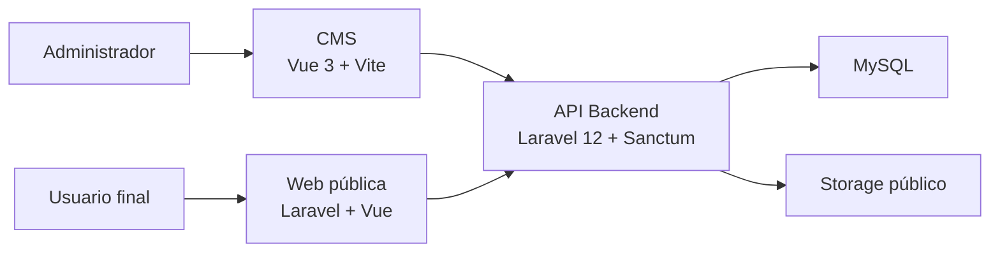

# ARSITE Platform

Repositorio principal del ecosistema ARSITE. Este proyecto concentra el backend de negocio, el CMS administrativo y la web pública corporativa.

## Arquitectura



## Estructura del repositorio

```text
ProyectoCompleto/
├─ ProyectoBackend/
│  ├─ arsite/          # API backend y lógica de negocio
│  └─ arsite-cms/      # Panel administrativo SPA
└─ ProyectoFront/
   └─ web-publica/     # Sitio público corporativo
```

## Aplicaciones incluidas

### `ProyectoBackend/arsite`
- API principal del sistema.
- Autenticación con Laravel Sanctum.
- Gestión de usuarios, banners, destacados, productos, servicios, partners, clientes, noticias, hitos y contactos.
- Exportaciones y manejo de archivos.

### `ProyectoBackend/arsite-cms`
- SPA administrativa desarrollada con Vue 3.
- Consume la API del backend.
- Centraliza la operación diaria del contenido del sitio.

### `ProyectoFront/web-publica`
- Sitio público corporativo.
- Presenta contenido institucional y consume endpoints públicos del backend.
- Incluye formularios de contacto e integración con contenido administrable.

## Stack de desarrollo

| Capa | Tecnologías principales |
|---|---|
| Backend | PHP 8.2+, Laravel 12, Sanctum, MySQL, Laravel Excel, DomPDF |
| CMS | Vue 3, Vite 7, Pinia, Vue Router 4, Axios, Tailwind CSS 4, TipTap |
| Web pública | Laravel 12, Vue 3, Vue Router 4, Axios, Vite 7, Tailwind CSS 4 |
| Herramientas | Composer, Node.js, npm, Laravel Pint, Pest/PHPUnit, ESLint, Prettier |

## Requisitos

- PHP `8.2` o superior
- Composer
- Node.js `20+`
- npm
- MySQL

## Puesta en marcha rápida

### 1. Backend

```bash
cd ProyectoBackend/arsite
composer install
npm install
copy .env.example .env
php artisan key:generate
php artisan migrate
php artisan storage:link
php artisan serve
```

En otra terminal:

```bash
cd ProyectoBackend/arsite
npm run dev
```

### 2. CMS

```bash
cd ProyectoBackend/arsite-cms
npm install
npm run dev
```

Variable recomendada:

```env
VITE_API_BASE_URL=http://127.0.0.1:8000/api
```

### 3. Web pública

```bash
cd ProyectoFront/web-publica
composer install
npm install
copy .env.example .env
php artisan key:generate
php artisan migrate
php artisan serve
```

En otra terminal:

```bash
cd ProyectoFront/web-publica
npm run dev
```

Variable recomendada:

```env
VITE_API_BASE_URL=http://127.0.0.1:8000/api
```

## Puertos sugeridos en local

| Servicio | URL sugerida |
|---|---|
| Backend API | `http://127.0.0.1:8000` |
| CMS | `http://127.0.0.1:5173` |
| Web pública Laravel | `http://127.0.0.1:8001` |
| Vite web pública | `http://127.0.0.1:5174` |

## Flujo funcional del sistema

1. El administrador gestiona contenido desde `arsite-cms`.
2. El CMS consume la API de `arsite`.
3. El backend valida, persiste datos y administra archivos.
4. La web pública consume endpoints públicos para mostrar contenido actualizado.
5. Formularios como `Contáctanos` registran datos en backend y pueden ser atendidos desde el CMS.

## Módulos principales

- Usuarios y autenticación
- Banners
- Destacados
- Productos
- Servicios
- Partners
- Clientes
- Noticias
- Hitos
- Contactos y respuestas desde CMS

## Documentación por aplicación

- [Backend `arsite`](./ProyectoBackend/arsite/README.md)
- [CMS `arsite-cms`](./ProyectoBackend/arsite-cms/README.md)
- [Web pública `web-publica`](./ProyectoFront/web-publica/README.md)

## Notas

- Este repositorio está organizado como un monorepo funcional.
- El backend es la fuente principal de verdad para contenido y autenticación.
- El CMS y la web pública deben apuntar al mismo backend para trabajar correctamente.
